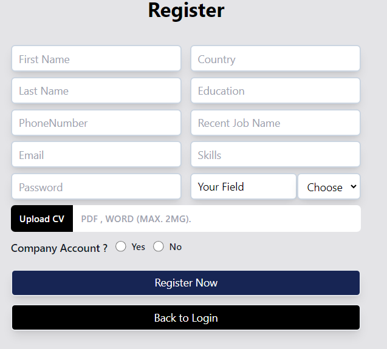

# MERAKI_Academy_Project_5
<p align="center">
<a href="https://www.meraki-academy.org" target="_blank" rel="noopener noreferrer">
 
 </a>
</p>

<h3 align="center">ًWorkedIn
</h3>

---

<p align="center">An application that helps people looking for work to find opportunities that suit their skills and experience
    <br> 

    <br> 
</p>

## 📝 Table of Contents

- [About](#about)
- [Getting Started](#getting_started)
- [Usage](#usage)
- [Built Using](#built_using)
- [User Story](#user_story)
- [Data Flow](#data_flow)
- [Guided By](#guided_by)

## 🧐 About <a name = "about"></a>
Are you someone looking for work? Or are you looking to improve your business by finding a better opportunity?
Our application is the solution
It helps you find people who are similar to your experience, specialization, and skills, and also find companies whose field suits you.
 You can  browse with users  their experiences and place of work and really communicate with them through chat. From their workplace, you can enter the name of the company and apply for jobs with it if there are any jobs.
As for the companies you are interested in, all the job opportunities offered by them will appear to you every time
Applying for jobs with us is done in the fastest way. When you click on the apply button, your CV is sent immediately to the company


## 🏁 Getting Started <a name = "getting_started"></a>

These instructions will get you a copy of the project up and running on your local machine for development and testing purposes.

### Prerequisites

- Visual Studio Code follow this <a href='https://code.visualstudio.com/download'>link</a> to install.
- Git Bash follow this <a href='https://git-scm.com/downloads'>link</a> to install.
- Sql(elepthant) follow this <a href='https://www.elephantsql.com/'>link</a> to install.
- Node.js follow this <a href='https://nodejs.org/en/download/'>link</a> to install.

### Installing:

1. Clone the repo to your local machine using git bash.

```
git clone https://github.com/your_username_/Project-Name.git
```

2. Install packeges repeat this step in backend and frontend folder

```
npm i
```

3. Run server using git bash inside backend folder

```
npm run dev
```

4. Run application using git bash inside frontend folder

```
npm  start
```

Now app ready to use

## 🎈 Usage <a name="usage"></a>
- you must register first
 or by google
 
2-login
using your email or by google

3-this is all pages 


this for your profile

in job page 

if you press on any job

press on appaly

this is your community post people who share with you your field

if you need any help just send for us your problem

you can update your info from here


## ⛏️ Built Using <a name = "built_using"></a>

- [SQlDB] - Database
- [Express JS](https://expressjs.com/) - Server Framework
- [React JS](https://https://reactjs.org/) - Web Framework
- [Node JS](https://nodejs.org/en/) - Server Environment

## User Story <a name = "#user_story"></a>

Your trello board link
<a href='https://trello.com/b/jssU32Pe/team3'>Trello</a>


